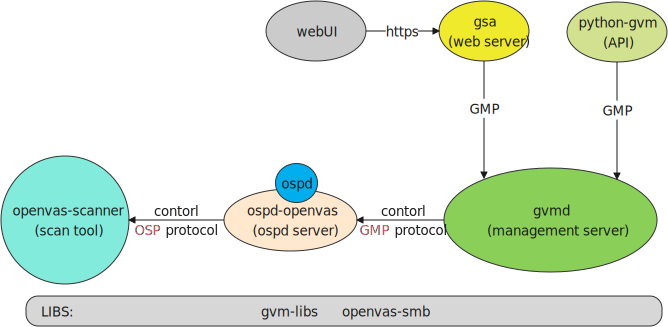

# openvas-packaging

> [(CentOS 8 build)](https://ufukyildirim.com.tr/centos-8-uzerinde-gvm-20-04-kurulumu/)
> [(CenOS 8 rpms)](https://centos.pkgs.org/8/atomic-x86_64/gvm-21.4.0-18432.el8.art.noarch.rpm.html)

===================

<!-- TOC -->

- [openvas-packaging](#openvas-packaging)
    - [Info](#info)
        - [openvas modules](#openvas-modules)
        - [openvas service](#openvas-service)
    - [Compile](#compile)
        - [Create build environment](#create-build-environment)
        - [Build sources](#build-sources)
        - [Build package](#build-package)
        - [Access openvas](#access-openvas)
    - [Reference](#reference)

<!-- /TOC -->

## Info



### openvas modules

| module                                                          | type             | description                                                                        |
| --------------------------------------------------------------- | ---------------- | ---------------------------------------------------------------------------------- |
| [gvm-libs](https://github.com/greenbone/gvm-libs)               | C Library        | Greenbone Vulnerability Management Libraries                                       |
| [openvas-smb](https://github.com/greenbone/openvas-smb)         | C Library        | SMB module for openvas Scanner                                                     |
| [ospd](https://github.com/greenbone/ospd)                       | Python Library   | a framework for vulnerability scanners which share the same communication protocol |
| [ospd-openvas](https://github.com/greenbone/ospd-openvas)       | Python Service   | an OSP server implementation to allow GVM to remotely control an openvas Scanner   |
| [gvmd](https://github.com/greenbone/gvmd)                       | C Service        | Greenbone Vulnerability Manager                                                    |
| [gsa](https://github.com/greenbone/gsa)                         | React-UI Service | Greenbone Security Assistant(webUI)                                                |
| [openvas-scanner](https://github.com/greenbone/openvas-scanner) | C tool           | Open Vulnerability Assessment Scanner                                              |

### openvas service

| service      | description                                                                      |
| ------------ | -------------------------------------------------------------------------------- |
| gvmd         | management server(for API and gsad)                                              |
| gsad         | web server(webUI)                                                                |
| ospd-openvas | a OSP server implementation to allow gvmd to remotely control an openvas Scanner |

-----------

## Compile

### Create build environment

install deps and tools

```bash
make init
```

### Build sources

build all modules

```bash
make build
```

### Build package

build `deb` package.

```bash
make deb
```

-------------

### Access openvas

| login    | description         |
| -------- | ------------------- |
| username | admin               |
| password | admin               |
| api      | `<IP>:9390`         |
| UI       | `https://<IP>:9392` |

## Reference

https://www.howtoforge.com/how-to-install-and-use-gvm-vulnerability-scanner-on-ubuntu-20-04/

[ yu210148/gvm_install - A script to install GVM 11 on Ubuntu 20.04 or Debian 10](https://github.com/yu210148/gvm_install)

https://kifarunix.com/install-and-setup-gvm-20-08-on-ubuntu/

https://sadsloth.net/post/install-gvm11-src-on-debian/
