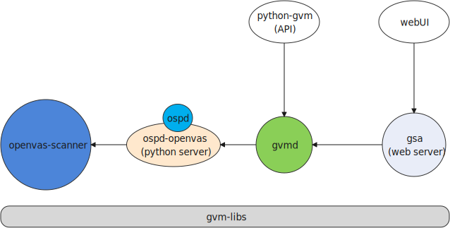

# openvas-packaging

> only tested in Ubuntu20.04(server). ubuntu18.04 has a guntls version issue for openvas-scanner

## Info



### OpenVAS modules

| module          | description                                                                                      |
| --------------- | ------------------------------------------------------------------------------------------------ |
| gvm-libs        | Greenbone Vulnerability Management Libraries                                                     |
| ospd            | OSPd is a framework for vulnerability scanners which share the same communication protocol       |
| ospd-openvas    | ospd-openvas is an OSP server implementation to allow GVM to remotely control an OpenVAS Scanner |
| gvmd            | Greenbone Vulnerability Manager                                                                  |
| gsa             | Greenbone Security Assistant(webUI)                                                              |
| openvas-scanner | Open Vulnerability Assessment Scanner                                                            |
| python-gvm      | Greenbone Vulnerability Management Python Library                                                |

### OpenVAS service

| service      | description                                            |
| ------------ | ------------------------------------------------------ |
| gvmd         | management server(for API and gsad)                    |
| gsad         | web server(webUI)                                      |
| ospd-openvas | a OSP server which gvmd can control openvas-scanner by |

-----------

## Compile

### prepare

install deps

intstall tools

download sources(all sources in dir `src`)

```bash
make init
```

### build

build and install all modules

```bash
make build
```

### data

download NVTs and feeds, so all data can be packed into deb.

this operation will take a long time, you can omit it.

```bash
make data
```

### pack

dbuild `deb` package.

```bash
make deb
```

-------------

## Install

```bash
apt install -y redis-server nmap snmp gnutls-bin \
  postgresql postgresql-contrib \
  libgpgme11 libical3 libradcli4 libssh-gcrypt-4 libnet1 \
  libhiredis0.14 libmicrohttpd12 \
  xml-twig-tools xsltproc

dpkg -i openvas-v21.4.0-amd64.deb
```

### data

if you pack `data` (make data) into `deb`, it still take a long time to process the data; 

otherwise you need download data manually by cmd below:

```bash
sudo -Hiu gvm /opt/gvm/bin/greenbone-nvt-sync
sudo -Hiu gvm /opt/gvm/sbin/greenbone-feed-sync --type GVMD_DATA
sudo -Hiu gvm /opt/gvm/sbin/greenbone-feed-sync --type SCAP
sudo -Hiu gvm /opt/gvm/sbin/greenbone-feed-sync --type CERT
sudo -Hiu gvm /opt/gvm/sbin/openvas --update-vt-info
```

### access

| login    | description         |
| -------- | ------------------- |
| username | admin               |
| password | admin               |
| api      | `<IP>:9390`         |
| UI       | `https://<IP>:9392` |

## Reference

[ yu210148/gvm_install - A script to install GVM 11 on Ubuntu 20.04 or Debian 10](https://github.com/yu210148/gvm_install)

https://kifarunix.com/install-and-setup-gvm-11-on-ubuntu-20-04/

https://sadsloth.net/post/install-gvm11-src-on-debian/
